# Terrateam Application Architecture

**A Comprehensive Analysis of the Multi-Layer Architecture**

---

## Table of Contents

1. [Executive Summary](#executive-summary)
2. [High-Level Architecture Overview](#high-level-architecture-overview)
3. [Layer-by-Layer Architecture](#layer-by-layer-architecture)
4. [Architectural Patterns](#architectural-patterns)
5. [Technology Stack](#technology-stack)
6. [Data Flow Architecture](#data-flow-architecture)
7. [Security Architecture](#security-architecture)
8. [Deployment Architecture](#deployment-architecture)
9. [API Architecture](#api-architecture)
10. [Build & Development Architecture](#build--development-architecture)

---

## Executive Summary

Terrateam is a sophisticated open-source Terraform automation platform built with a **multi-layer, schema-driven architecture**. The system is designed to handle thousands of workspaces across monorepos with GitOps workflows, policy enforcement, cost estimation, and drift detection.

### Key Architectural Principles

- **Schema-First Development**: OpenAPI specifications drive type-safe code generation
- **Modular Microservices**: 193+ OCaml modules with precise dependency management
- **Multi-Platform Deployment**: Docker containerization with multi-architecture support
- **Type Safety**: End-to-end type safety from API to UI using OCaml and TypeScript
- **Performance-Oriented**: Custom async runtime (ABB) optimized for I/O-heavy operations
- **GitOps Integration**: Deep GitHub/GitLab integration with webhook-driven workflows

---

## High-Level Architecture Overview

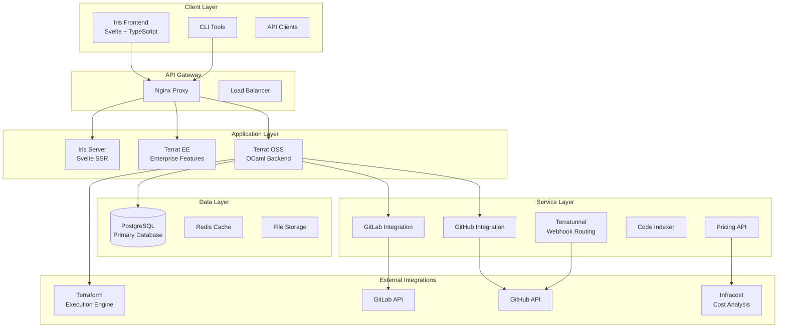

---

## Layer-by-Layer Architecture

### 1. Container Layer (Docker)

The container layer provides **multi-stage, optimized containerization** with specialized images for different components.

#### Primary Container Images

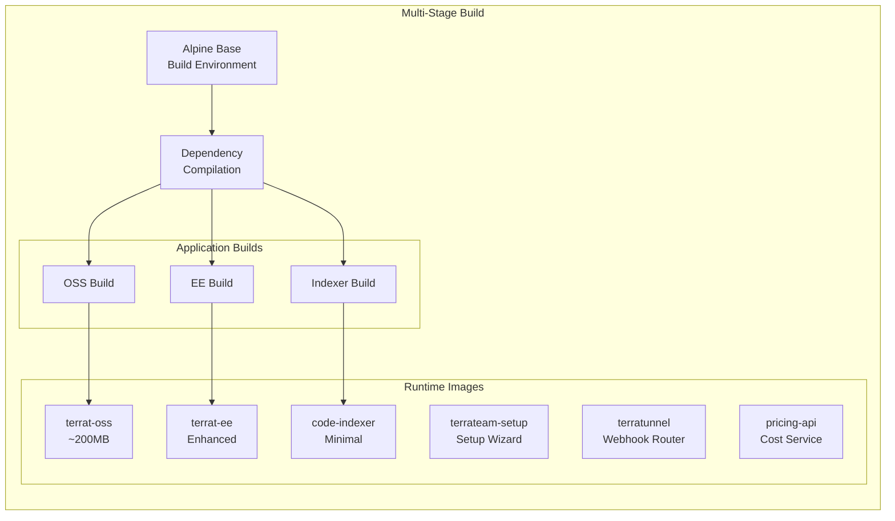

**Key Features:**
- **Multi-architecture support** (AMD64/ARM64)
- **Layer caching optimization** for fast builds
- **Minimal runtime images** (Alpine-based, ~200MB)
- **libkqueue integration** for high-performance I/O

### 2. Build System (PDS/Make)

The build system uses **PDS (Package Description System)** for managing 193+ OCaml modules with precise dependency tracking.

#### Build Architecture Flow

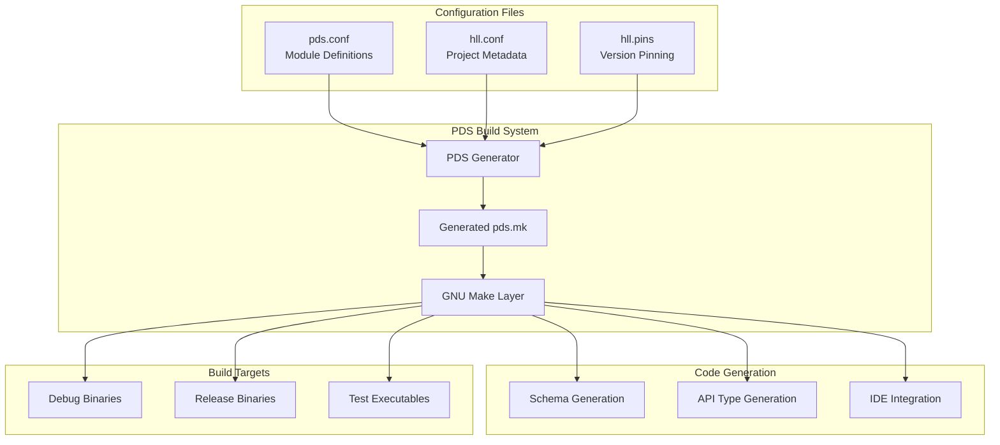

**Module Dependency Architecture:**
- **193+ OCaml modules** organized by functional domains
- **ABB Framework**: Application Building Blocks for async operations
- **BRTL Framework**: Web framework components
- **Domain Modules**: Terraform-specific business logic

### 3. Backend (OCaml)

The backend is built with a **sophisticated OCaml architecture** featuring custom frameworks and domain-driven design.

#### Core Framework Architecture

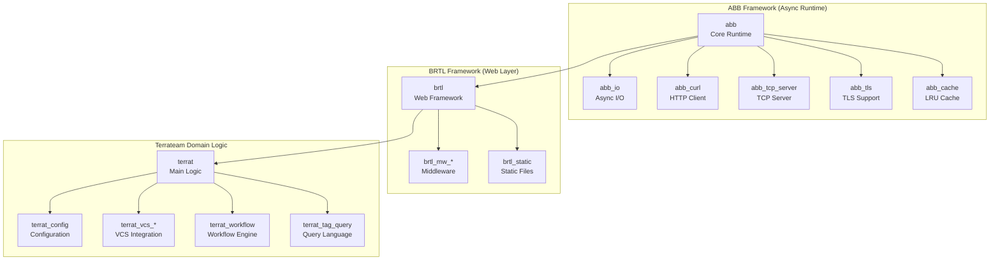

**Key Backend Patterns:**
- **High-performance async runtime** with platform-specific optimizations
- **Result-based error handling** with comprehensive error types
- **Domain-driven module organization** (193+ modules)
- **Type-safe API layer** with generated OCaml types

### 4. Frontend (Iris - Svelte)

The frontend is a **modern Svelte-based SPA** with comprehensive TypeScript integration and accessibility features.

#### Frontend Architecture

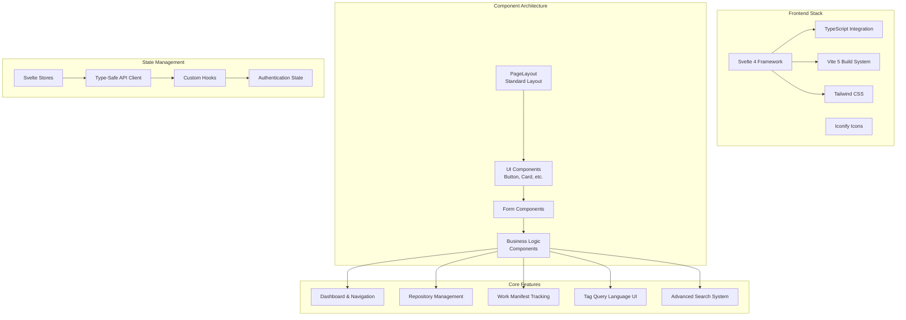

**Frontend Key Features:**
- **Type-safe API integration** with runtime validation
- **Accessibility-first design** with comprehensive A11y support
- **Tag Query Language** for advanced server-side filtering
- **CSP-compliant styling** (no inline styles)

### 5. Scripts & Operations Layer

The operations layer provides **automated deployment and release management** across multiple environments.

#### Operations Workflow

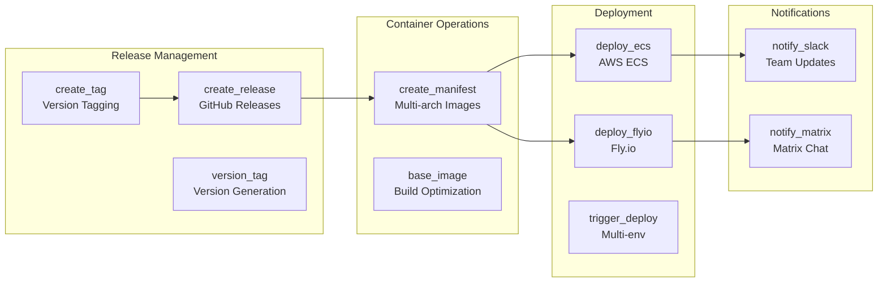

### 6. Schemas & Configuration Layer

The schema layer implements a **schema-first architecture** with comprehensive type generation and validation.

#### Schema Generation Pipeline

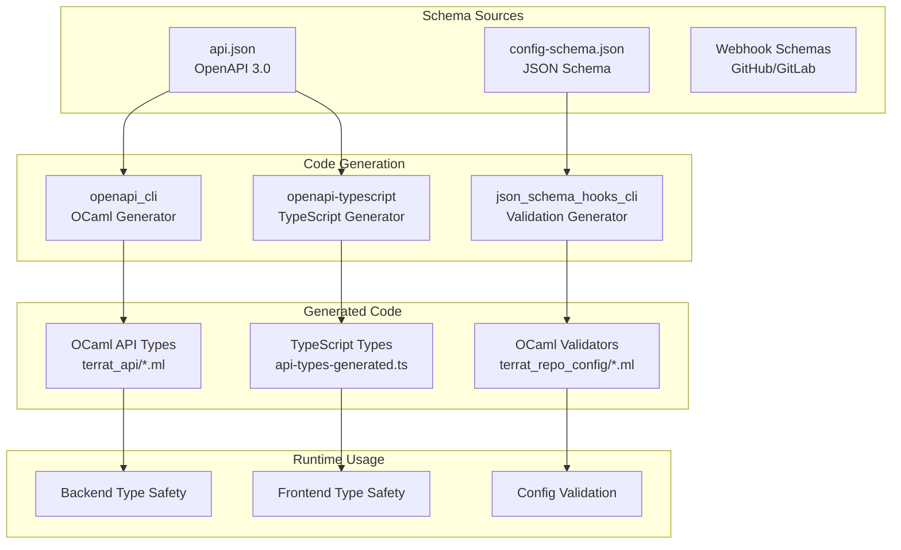

---

## Architectural Patterns

### 1. Schema-Driven Architecture

**Pattern**: All APIs and configurations are defined in schemas first, then code is generated.

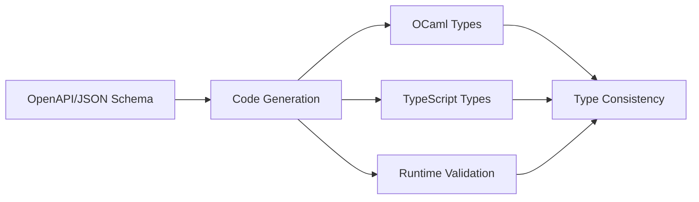

**Benefits:**
- **Type safety** across the entire stack
- **API consistency** between frontend and backend  
- **Automatic documentation** from schemas
- **Validation** at compile-time and runtime

### 2. Domain-Driven Design (DDD)

**Pattern**: 193+ modules organized by business domains rather than technical layers.

**Domain Organization:**
- **VCS Integration**: `terrat_vcs_*`, `terrat_github`, `terrat_gitlab`
- **Workflow Management**: `terrat_change`, `terrat_work_manifest3`, `terrat_dirspace`
- **Authentication**: `terrat_access_control2`, `terrat_user`, `terrat_session`
- **Query System**: `terrat_tag_query`, `terrat_sql_of_tag_query`

### 3. Layered Architecture

**Pattern**: Clear separation of concerns across architectural layers.

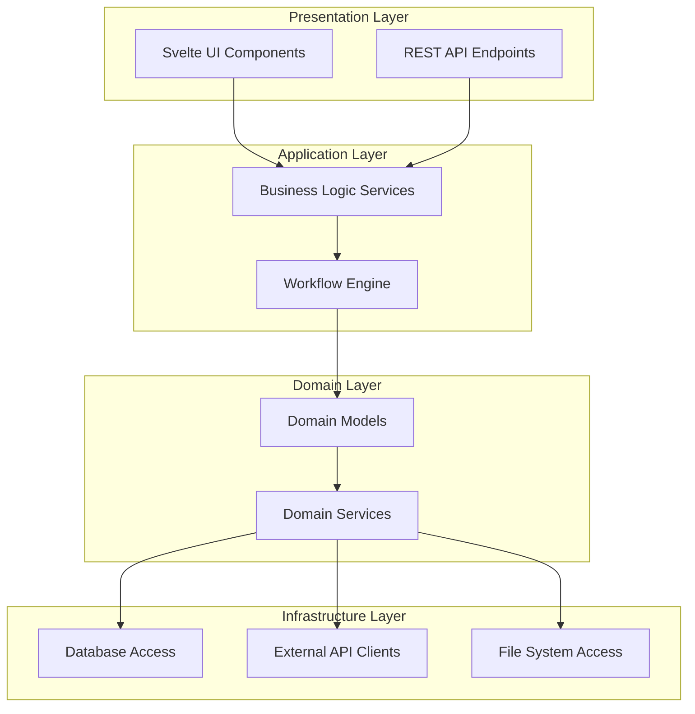

### 4. Event-Driven Architecture

**Pattern**: Webhook-driven workflows with asynchronous processing.

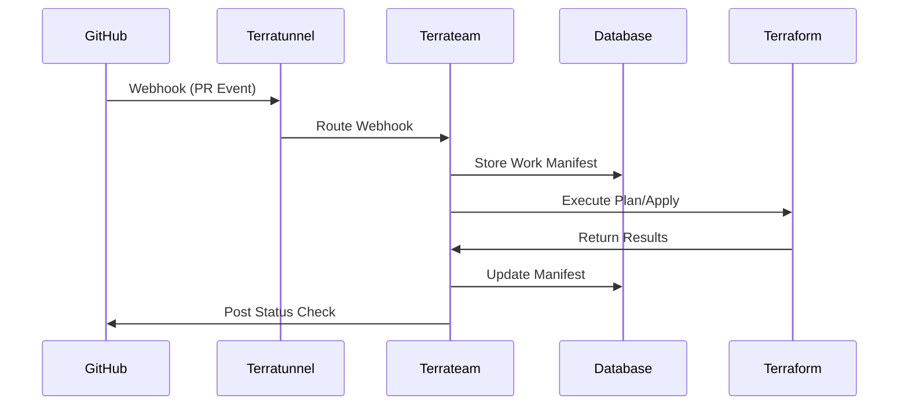

### 5. Microservices Architecture

**Pattern**: Specialized services for different concerns.

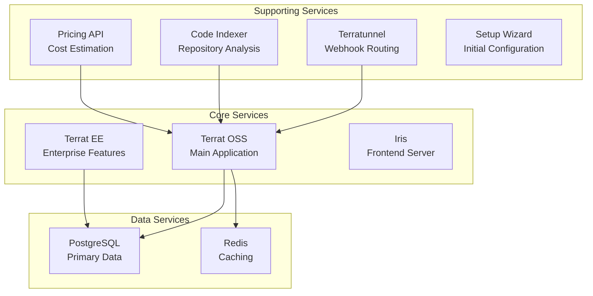

---

## Technology Stack

### Backend Technologies

| Component | Technology | Purpose |
|-----------|------------|---------|
| **Runtime** | OCaml 5.3.0+ | High-performance functional programming |
| **Async Framework** | ABB (Custom) | Custom async runtime with platform optimizations |
| **Web Framework** | BRTL (Custom) | Type-safe web framework built on ABB |
| **Database** | PostgreSQL 14.5+ | Primary data store |
| **Caching** | Redis | Session and data caching |
| **Build System** | PDS + Make | Modular build with precise dependencies |

### Frontend Technologies

| Component | Technology | Purpose |
|-----------|------------|---------|
| **Framework** | Svelte 4 | Reactive frontend framework |
| **Language** | TypeScript | Type-safe JavaScript |
| **Build Tool** | Vite 5 | Fast development and build |
| **Styling** | Tailwind CSS | Utility-first CSS framework |
| **Icons** | Iconify | Comprehensive icon system |
| **State Management** | Svelte Stores | Reactive state management |

### Infrastructure Technologies

| Component | Technology | Purpose |
|-----------|------------|---------|
| **Containerization** | Docker | Multi-stage builds and deployment |
| **Orchestration** | Docker Compose | Local development and self-hosted |
| **Cloud Platforms** | AWS ECS, Fly.io | Production deployment |
| **Networking** | Nginx | Reverse proxy and load balancing |
| **Monitoring** | Custom Health Checks | Service health and availability |

---

## Data Flow Architecture

### Request Processing Flow

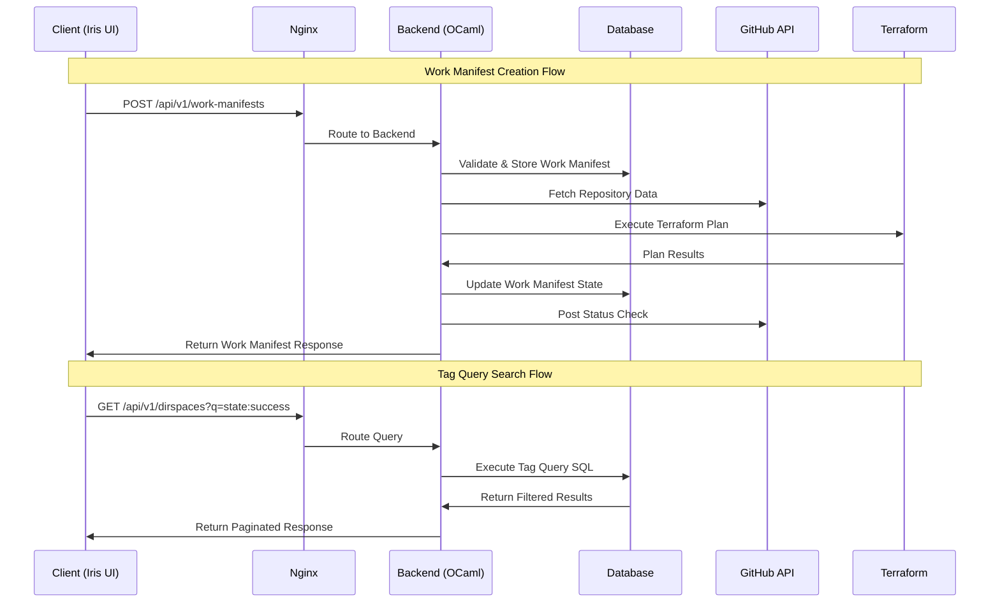

### Data Model Architecture

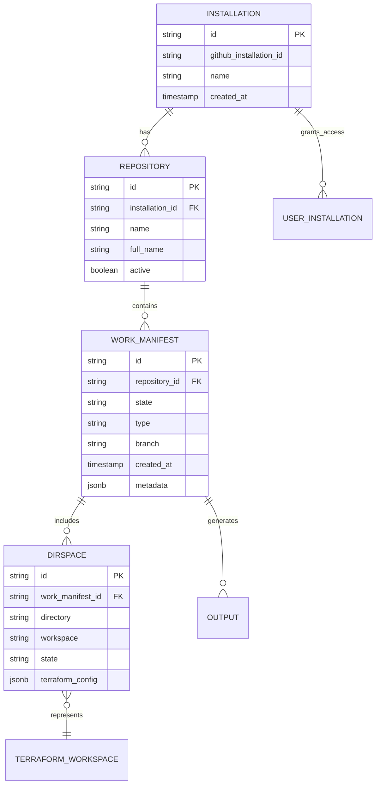

---

## Security Architecture

### Authentication & Authorization Flow

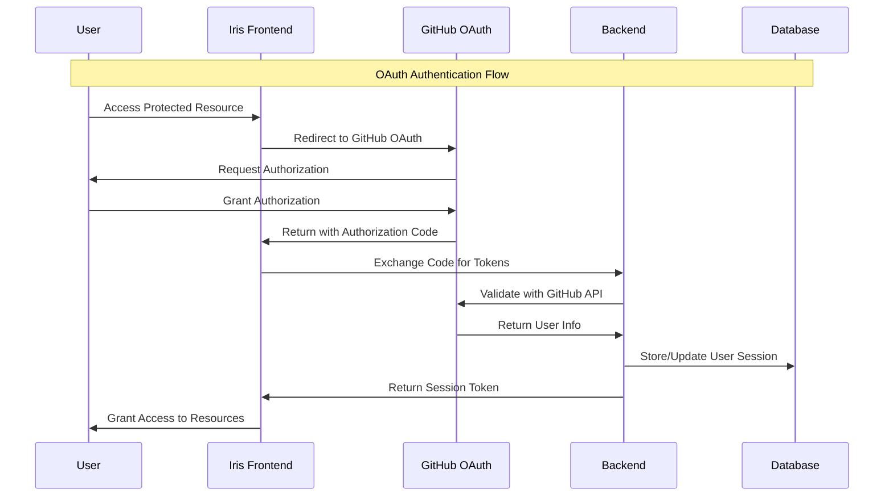

### Security Layers

1. **Transport Security**: TLS encryption for all communications
2. **Authentication**: GitHub OAuth with session management
3. **Authorization**: Role-based access control (RBAC) in Enterprise
4. **Input Validation**: Schema-based validation for all inputs
5. **SQL Injection Protection**: Parameterized queries and ORM
6. **XSS Protection**: Content Security Policy (CSP) compliance
7. **Webhook Security**: HMAC signature verification

---

## Deployment Architecture

### Self-Hosted Deployment

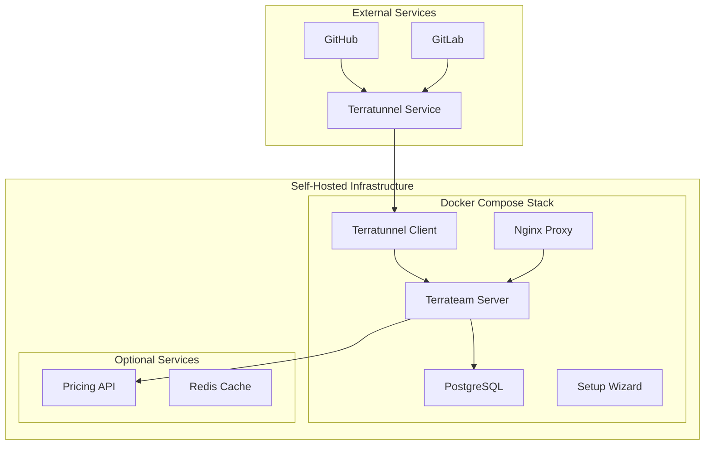

### Cloud Deployment (Production)

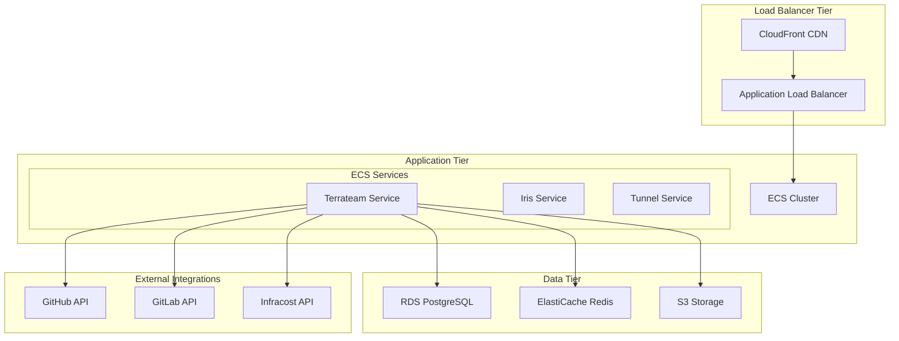

---

## API Architecture

### RESTful API Design

The API follows **OpenAPI 3.0 specifications** with comprehensive type generation and validation.

#### Core API Endpoints

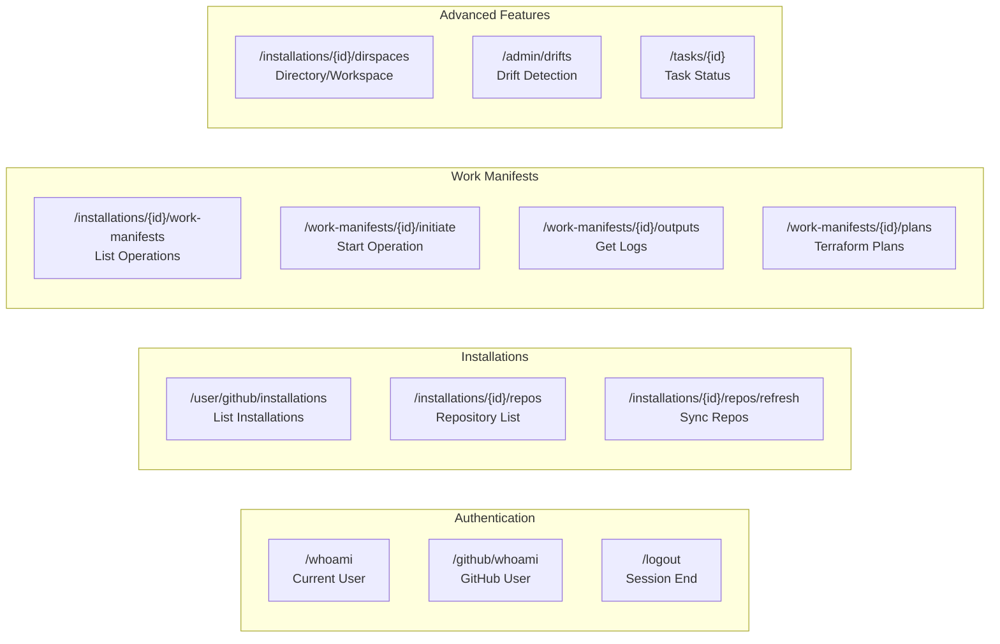

#### API Patterns

1. **RFC 5988 Link Header Pagination**: Same as GitHub API
2. **Type-Safe Responses**: Generated from OpenAPI schemas
3. **Comprehensive Error Handling**: Structured error responses
4. **Tag Query Language**: Server-side filtering with powerful query syntax

### Tag Query Language Architecture

The **Tag Query Language** enables powerful server-side filtering of operations.

#### Query Architecture

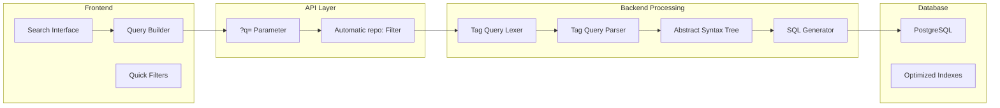

**Query Examples:**
- `state:success and user:josh`
- `type:apply and branch:main`
- `created_at:2024-01-01.. and environment:production`
- `pr:123 and state:failure`

---

## Build & Development Architecture

### Development Workflow

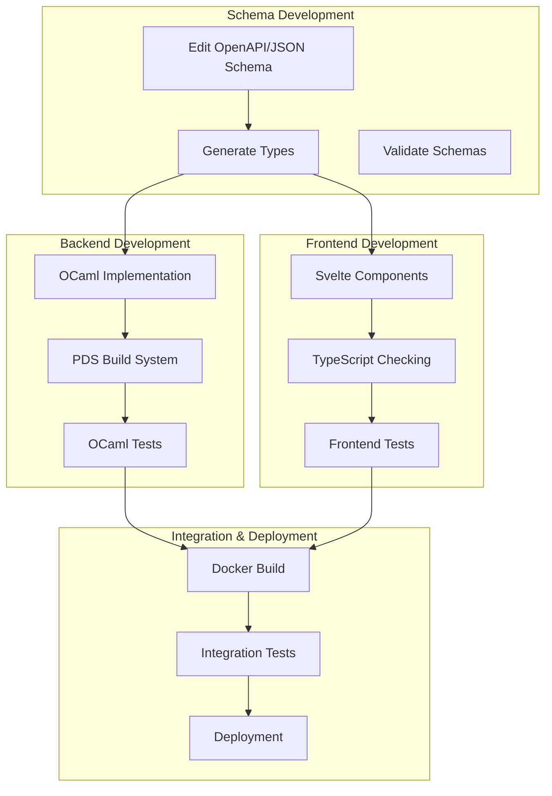

### Quality Assurance Pipeline

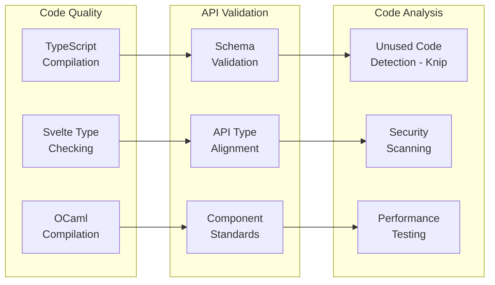

---

## Conclusion

Terrateam's architecture represents a sophisticated, multi-layer system designed for **scale, type safety, and maintainability**. The combination of OCaml's performance and type safety with Svelte's modern UI capabilities, all orchestrated through a schema-driven approach, provides a robust foundation for enterprise Terraform automation.

### Key Architectural Strengths

1. **Type Safety**: End-to-end type safety from database to UI
2. **Performance**: Custom async runtime optimized for I/O operations
3. **Modularity**: 193+ modules with precise dependency management
4. **Scalability**: Microservices architecture with container orchestration
5. **Developer Experience**: Schema-driven development with generated types
6. **Security**: Comprehensive security layers with OAuth and RBAC
7. **Deployment Flexibility**: Support for self-hosted and cloud deployments

This architecture enables Terrateam to handle enterprise-scale Terraform operations while maintaining developer productivity and system reliability.