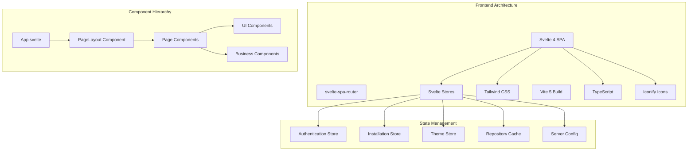

# Terrateam Iris Frontend Architecture Analysis

**Focused Analysis of the Svelte + Tailwind CSS Frontend Layer**

---

## Table of Contents

1. [Architecture Overview](#architecture-overview)
2. [Good Design Patterns](#good-design-patterns)
3. [Bad Design Patterns & Antipatterns](#bad-design-patterns--antipatterns)
4. [Svelte Implementation Analysis](#svelte-implementation-analysis)
5. [Tailwind CSS Implementation](#tailwind-css-implementation)
6. [UI/UX Improvement Opportunities](#uiux-improvement-opportunities)
7. [Performance Considerations](#performance-considerations)
8. [Accessibility Assessment](#accessibility-assessment)
9. [Strategic Recommendations](#strategic-recommendations)

---

## Architecture Overview

### Current Frontend Stack



### Component Organization

**File Structure Analysis**:
```
src/
├── lib/
│   ├── components/
│   │   ├── ui/           # ✅ 9 reusable UI components
│   │   ├── layout/       # ✅ 3 layout components  
│   │   └── terraform/    # ✅ Domain-specific components
│   ├── types/            # ✅ TypeScript definitions
│   ├── utils/            # ✅ Utility functions
│   ├── services/         # ✅ Business logic services
│   ├── vcs/              # ✅ VCS abstraction
│   └── icons/            # ✅ Icon management
└── [35 page/feature components] # ⚠️ Needs better organization
```

---

## Good Design Patterns

### ✅ **Excellent Patterns**

#### 1. **Consistent Layout Architecture** ⭐⭐⭐⭐⭐
```svelte
<!-- Every page uses PageLayout wrapper -->
<script lang="ts">
  import PageLayout from './components/layout/PageLayout.svelte';
</script>

<PageLayout activeItem="dashboard" title="Dashboard" subtitle="Overview">
  <!-- Page content -->
</PageLayout>
```

**Strengths**:
- **Consistency**: All pages share identical layout structure
- **Mobile Responsive**: Built-in mobile menu handling
- **Authentication**: Automatic auth checking and redirection
- **Accessibility**: Proper ARIA labels and keyboard navigation

#### 2. **Component Design System** ⭐⭐⭐⭐⭐
```svelte
<!-- Type-safe, variant-based component API -->
<Button variant="accent" size="lg" loading={isSubmitting}>
  Submit
</Button>

<Card padding="md" hover={true} border={true}>
  Content
</Card>
```

**Strengths**:
- **Type Safety**: Full TypeScript integration with `$$Props`
- **Variant System**: Consistent styling via predefined variants
- **Composability**: Components accept additional props via `$$restProps`
- **Accessibility**: Built-in ARIA support and keyboard handling

#### 3. **Advanced State Management** ⭐⭐⭐⭐
```typescript
// Sophisticated state management with persistence
function createPersistentRepositoryCache() {
  const { subscribe, set, update } = writable<Repository[]>([]);
  
  return {
    subscribe,
    set: (value: Repository[], installationId?: string) => {
      set(value);
      // Auto-persist to localStorage with installation scoping
      if (installationId) {
        localStorage.setItem(`repositories-cache-${installationId}`, 
          JSON.stringify({ repositories: value, timestamp: Date.now() }));
      }
    },
    loadFromCache: (installationId: string) => { /* ... */ }
  };
}
```

**Strengths**:
- **Persistent Caching**: Automatic localStorage persistence
- **Installation Scoping**: Separate caches per installation
- **Type Safety**: Full TypeScript integration
- **Performance**: Reduces API calls through intelligent caching

#### 4. **VCS Provider Abstraction** ⭐⭐⭐⭐
```typescript
// Clean abstraction for multiple VCS providers
export const VCS_PROVIDERS = {
  github: {
    displayName: 'GitHub',
    terminology: {
      organization: 'Organization',
      repository: 'Repository'
    }
  },
  gitlab: {
    displayName: 'GitLab', 
    terminology: {
      organization: 'Group',
      repository: 'Project'
    }
  }
};
```

**Strengths**:
- **Future-Proof**: Easy to add new VCS providers
- **Terminology Consistency**: Provider-specific language
- **Type Safety**: Strongly typed provider definitions

#### 5. **Tailwind Design System** ⭐⭐⭐⭐
```javascript
// Custom design tokens with brand consistency
theme: {
  extend: {
    colors: {
      'brand': {
        'primary': '#009bff',
        'secondary': '#12223f', 
        'tertiary': '#e7f67e',
      }
    },
    fontSize: {
      // Accessibility-focused larger font sizes
      'xs': ['1rem', { lineHeight: '1.5rem' }],     // 16px instead of 12px
      'sm': ['1.125rem', { lineHeight: '1.75rem' }], // 18px instead of 14px
    }
  }
}
```

**Strengths**:
- **Brand Consistency**: Custom color tokens
- **Accessibility**: Larger font sizes for better readability
- **Design System**: Consistent spacing and typography scales

### ✅ **Good Patterns**

#### 6. **Theme System** ⭐⭐⭐⭐
```typescript
// Comprehensive dark/light theme support
export const theme = {
  init() {
    const stored = localStorage.getItem('theme');
    const system = window.matchMedia('(prefers-color-scheme: dark)').matches;
    this.set(stored || (system ? 'dark' : 'light'));
  },
  
  set(mode: ThemeMode) {
    document.documentElement.classList.toggle('dark', mode === 'dark');
    localStorage.setItem('theme', mode);
  }
};
```

**Strengths**:
- **System Integration**: Respects OS theme preference
- **Persistence**: Remembers user choice
- **CSS Integration**: Works seamlessly with Tailwind dark: classes

#### 7. **Error Handling Patterns** ⭐⭐⭐
```svelte
<!-- Consistent error UI patterns -->
{#if $installationsError}
  <ErrorMessage type="error" message={$installationsError} />
{:else if $installationsLoading}
  <LoadingSpinner size="lg" />
{:else}
  <!-- Success state -->
{/if}
```

**Strengths**:
- **Consistent UI**: Standardized error/loading states
- **User Experience**: Clear feedback for all states
- **Component Reuse**: Shared error/loading components

---

## Bad Design Patterns & Antipatterns

### 🔴 **Critical Issues**

#### 1. **Massive App.svelte Complexity** ⭐
**Issue**: App.svelte is 233 lines with complex routing and state logic
```svelte
<!-- App.svelte - Too many responsibilities -->
<script lang="ts">
  // 17 different imports
  import router from 'svelte-spa-router';
  import { isAuthenticated, isLoading, getCurrentUser } from './lib/auth';
  // + 15 more imports...
  
  // Complex routing logic (75+ routes)
  const routes = {
    '/': RootHandler,
    '/login': Login,
    // ... 70+ more routes
  };
  
  // Complex authentication logic
  $: if (!maintenanceConfig.isMaintenanceMode && $isAuthenticated && !$isLoading) {
    // 20+ lines of redirect logic
  }
  
  // Installation loading logic
  async function loadInstallations() {
    // 40+ lines of complex installation handling
  }
</script>
```

**Problems**:
- **Single Responsibility Violation**: App.svelte handles routing, auth, installations, redirects
- **Testing Difficulty**: Complex interdependent logic hard to test
- **Maintenance Burden**: Changes require understanding entire app flow
- **Performance**: All logic runs on every app load

**Recommended Fix**:
```svelte
<!-- Split into focused components -->
<script lang="ts">
  import AppRouter from './lib/components/routing/AppRouter.svelte';
  import AuthHandler from './lib/components/auth/AuthHandler.svelte';
  import InstallationManager from './lib/components/installations/InstallationManager.svelte';
  import MaintenanceCheck from './lib/components/system/MaintenanceCheck.svelte';
</script>

<MaintenanceCheck>
  <AuthHandler>
    <InstallationManager>
      <AppRouter />
    </InstallationManager>
  </AuthHandler>
</MaintenanceCheck>
```

#### 2. **Inconsistent Button Styling** ⭐⭐
**Issue**: Button component has confusing and broken color combinations
```svelte
<!-- Button.svelte - Color issues -->
const variantClasses = {
  primary: 'bg-brand-primary text-brand-primary border border-brand-primary',
  //       ^^^^ SAME COLOR ^^^^^ - Text invisible on background!
  
  secondary: 'bg-brand-secondary text-brand-primary border border-brand-secondary',
  //         Dark blue background + blue text = poor contrast
  
  accent: 'accent-bg hover:bg-accent-hover',  // Undefined CSS classes!
};
```

**Problems**:
- **Accessibility Violation**: Text invisible on same-color background
- **Undefined CSS**: `accent-bg` and `accent-hover` classes don't exist
- **Poor Contrast**: Dark blue + blue text combination
- **Inconsistent Naming**: Mix of semantic and visual naming

**Recommended Fix**:
```svelte
const variantClasses = {
  primary: 'bg-brand-primary text-white border border-brand-primary hover:bg-blue-700',
  secondary: 'bg-gray-100 text-gray-900 border border-gray-300 hover:bg-gray-200', 
  accent: 'bg-brand-tertiary text-gray-900 border border-brand-tertiary hover:bg-yellow-400',
  outline: 'bg-transparent text-brand-primary border border-brand-primary hover:bg-brand-primary hover:text-white'
};
```

#### 3. **Component Organization Chaos** ⭐⭐
**Issue**: 35 page components scattered in `/lib` with inconsistent patterns

```
src/lib/
├── Dashboard.svelte           # ❌ Page in root
├── Repositories.svelte        # ❌ Page in root  
├── Login.svelte              # ❌ Page in root
├── components/
│   ├── ui/Button.svelte      # ✅ Correct location
│   └── layout/PageLayout.svelte # ✅ Correct location
├── RunDetail.svelte          # ❌ Should be in pages/
├── WorkspaceDetail.svelte    # ❌ Should be in pages/
└── [30 more mixed components] # ❌ Inconsistent organization
```

**Problems**:
- **Discoverability**: Hard to find components
- **Import Confusion**: Unclear component relationships
- **Maintenance**: Difficult to refactor when files are scattered
- **Team Productivity**: New developers struggle with organization

#### 4. **Tailwind Configuration Issues** ⭐⭐
**Issue**: Font size overrides break standard conventions
```javascript
// Tailwind config - Confusing font scale
fontSize: {
  'xs': ['1rem', { lineHeight: '1.5rem' }],     // 16px labeled as "xs"!
  'sm': ['1.125rem', { lineHeight: '1.75rem' }], // 18px labeled as "sm"!
  'base': ['1.25rem', { lineHeight: '2rem' }],   // 20px labeled as "base"!
}
```

**Problems**:
- **Developer Confusion**: `text-xs` is actually large text (16px)
- **Third-Party Conflicts**: Breaks component libraries expecting standard sizes
- **Documentation**: Tailwind docs no longer apply to project
- **Maintenance**: Future developers expect standard Tailwind behavior

### 🟡 **Moderate Issues**

#### 5. **State Management Scattered Logic** ⭐⭐⭐
```typescript
// stores.ts - Multiple concerns mixed
export const installations: Writable<Installation[]> = writable([]);
export const selectedInstallation: Writable<Installation | null> = writable(null);
export const installationsLoading: Writable<boolean> = writable(false);
export const installationsError: Writable<string | null> = writable(null);
export const repositories: Writable<Repository[]> = writable([]);
export const repositoriesLoading: Writable<boolean> = writable(false);
// ... 15 more global stores
```

**Problems**:
- **Global State Overuse**: Everything is global instead of scoped
- **Tight Coupling**: Changes to one store affect many components
- **Testing Difficulty**: Hard to isolate state for testing
- **Performance**: Unnecessary re-renders from global state changes

#### 6. **CSS Class Inconsistencies** ⭐⭐
```svelte
<!-- Inconsistent color usage throughout components -->
<header class="shadow bg-blue-600 dark:bg-gray-800">  <!-- Hard-coded blue -->
<div class="bg-brand-primary">                        <!-- Brand token -->
<button class="bg-green-600 hover:bg-green-700">     <!-- Hard-coded green -->
```

**Problems**:
- **Brand Inconsistency**: Mix of brand tokens and hard-coded colors
- **Maintenance**: Updates require finding all hard-coded values
- **Design System**: Breaks design system principles

#### 7. **Missing Component Boundaries** ⭐⭐
```svelte
<!-- PageLayout.svelte doing too much -->
<script lang="ts">
  // Authentication logic
  $: if (!$isAuthenticated) {
    storeIntendedUrl();
    window.location.hash = '#/login';
  }
  
  // Mobile menu logic
  function toggleMobileMenu() { /* ... */ }
  
  // Installation banner logic
  // Theme handling
  // Terminology resolution
  // Navigation handling
</script>
```

**Problems**:
- **Single Responsibility Violation**: Layout component handles auth, navigation, state
- **Reusability**: Tightly coupled to specific app logic
- **Testing**: Difficult to test layout separately from business logic

---

## Svelte Implementation Analysis

### ✅ **Svelte Strengths**

#### 1. **Reactive Patterns** ⭐⭐⭐⭐⭐
```svelte
<!-- Excellent reactive patterns -->
<script lang="ts">
  // Reactive statements for computed values
  $: currentProvider = $currentVCSProvider || 'github';
  $: terminology = VCS_PROVIDERS[currentProvider]?.terminology;
  
  // Reactive effects with dependency tracking
  $: if ($isAuthenticated && !$isLoading && installationsInitialized) {
    loadInstallations();
  }
</script>
```

**Strengths**:
- **Automatic Dependencies**: Svelte tracks reactive dependencies
- **Performance**: Only re-runs when dependencies change
- **Clean Syntax**: More readable than useEffect patterns

#### 2. **Store Integration** ⭐⭐⭐⭐
```svelte
<!-- Seamless store integration -->
<script lang="ts">
  import { installations, selectedInstallation } from './stores';
</script>

<!-- Auto-subscribes/unsubscribes -->
{#if $installations.length > 0}
  Selected: {$selectedInstallation?.name}
{/if}
```

**Strengths**:
- **Automatic Subscription**: No manual subscribe/unsubscribe
- **Type Safety**: Full TypeScript integration
- **Performance**: Efficient reactive updates

#### 3. **Component Props & Events** ⭐⭐⭐⭐
```svelte
<!-- Type-safe component interfaces -->
<script lang="ts">
  interface $$Props extends HTMLButtonAttributes {
    variant?: 'primary' | 'secondary';
    loading?: boolean;
  }
  
  export let variant: $$Props['variant'] = 'primary';
  export let loading: $$Props['loading'] = false;
</script>

<button {...$$restProps} on:click on:focus>
  <slot />
</button>
```

**Strengths**:
- **Type Safety**: Full TypeScript integration
- **Flexibility**: Supports all HTML attributes
- **Event Forwarding**: Proper event delegation

### ⚠️ **Svelte Issues**

#### 1. **Over-Reliance on Global Stores**
```typescript
// Too many global stores
export const installations: Writable<Installation[]> = writable([]);
export const repositories: Writable<Repository[]> = writable([]);
export const workspaces: Writable<Workspace[]> = writable([]);
export const runs: Writable<Run[]> = writable([]);
// ... 15+ more global stores
```

**Problems**:
- **Tight Coupling**: Components depend on global state
- **Testing Difficulty**: Hard to isolate component behavior
- **Performance**: Global state changes trigger unnecessary re-renders

**Recommendation**: Use local component state and pass props down

#### 2. **Missing Error Boundaries**
Svelte doesn't have React-style error boundaries, but the app lacks error handling patterns:

```svelte
<!-- No error boundary pattern -->
{#if loading}
  <LoadingSpinner />
{:else}
  <!-- What if this component throws? -->
  <ComplexBusinessComponent />
{/if}
```

**Recommendation**: Implement error boundary pattern with try/catch and error stores

---

## Tailwind CSS Implementation

### ✅ **Tailwind Strengths**

#### 1. **Custom Design System** ⭐⭐⭐⭐
```javascript
// Good brand integration
colors: {
  'brand': {
    'primary': '#009bff',
    'secondary': '#12223f',
    'tertiary': '#e7f67e',
  }
}
```

#### 2. **Dark Mode Support** ⭐⭐⭐⭐
```svelte
<!-- Consistent dark mode classes -->
<div class="bg-white dark:bg-gray-800 text-gray-900 dark:text-gray-100">
```

#### 3. **Responsive Design** ⭐⭐⭐⭐
```svelte
<!-- Mobile-first responsive patterns -->
<div class="px-4 md:px-6 py-4">
  <h1 class="text-lg md:text-2xl font-semibold">
```

### ⚠️ **Tailwind Issues**

#### 1. **Font Size Confusion** ⭐
```javascript
// Breaks Tailwind conventions
fontSize: {
  'xs': ['1rem', { lineHeight: '1.5rem' }],  // 16px called "extra small"!
}
```

**Problem**: Violates principle of least surprise

#### 2. **Missing Utilities**
```svelte
<!-- Components reference undefined classes -->
<Button variant="accent" /> 
<!-- Uses 'accent-bg' and 'accent-hover' classes that don't exist -->
```

#### 3. **Inconsistent Color Usage**
```svelte
<!-- Mix of brand tokens and hard-coded colors -->
<div class="bg-blue-600 dark:bg-gray-800">     <!-- Should use brand token -->
<div class="bg-brand-primary">                 <!-- Correct usage -->
<div class="text-green-600">                   <!-- Should be brand/semantic -->
```

---

## UI/UX Improvement Opportunities

### 🎯 **High-Impact Improvements**

#### 1. **Component Library Standardization**
**Current State**: 9 UI components with inconsistent APIs
**Recommended**: Expand to comprehensive design system

```typescript
// Recommended component library structure
interface DesignSystemComponents {
  // Form Components
  Input: React.ComponentType<InputProps>;
  Select: React.ComponentType<SelectProps>;
  Checkbox: React.ComponentType<CheckboxProps>;
  RadioGroup: React.ComponentType<RadioGroupProps>;
  
  // Feedback Components  
  Alert: React.ComponentType<AlertProps>;
  Toast: React.ComponentType<ToastProps>;
  Modal: React.ComponentType<ModalProps>;
  Tooltip: React.ComponentType<TooltipProps>;
  
  // Data Display
  Table: React.ComponentType<TableProps>;
  Badge: React.ComponentType<BadgeProps>;
  Avatar: React.ComponentType<AvatarProps>;
  
  // Navigation
  Breadcrumb: React.ComponentType<BreadcrumbProps>;
  Pagination: React.ComponentType<PaginationProps>;
  Tabs: React.ComponentType<TabsProps>;
}
```

#### 2. **Advanced Loading States**
**Current**: Basic spinner only
**Recommended**: Skeleton loading and progressive disclosure

```svelte
<!-- Current loading -->
{#if loading}
  <LoadingSpinner />
{/if}

<!-- Recommended skeleton loading -->
{#if loading}
  <div class="space-y-4">
    <div class="animate-pulse">
      <div class="h-4 bg-gray-300 rounded w-3/4 mb-2"></div>
      <div class="h-4 bg-gray-300 rounded w-1/2"></div>
    </div>
  </div>
{:else}
  <!-- Content -->
{/if}
```

#### 3. **Empty State Improvements**
**Current**: Basic "no data" messages
**Recommended**: Actionable empty states with illustrations

```svelte
<!-- Enhanced empty state component -->
<script lang="ts">
  export let icon: string = 'repo';
  export let title: string;
  export let description: string;
  export let actionText: string = '';
  export let onAction: () => void = () => {};
</script>

<div class="text-center py-12">
  <Icon name={icon} size="xl" class="mx-auto text-gray-400 mb-4" />
  <h3 class="text-lg font-medium text-gray-900 dark:text-gray-100 mb-2">
    {title}
  </h3>
  <p class="text-sm text-gray-500 dark:text-gray-400 mb-6">
    {description}
  </p>
  {#if actionText}
    <Button variant="primary" on:click={onAction}>
      {actionText}
    </Button>
  {/if}
</div>
```

#### 4. **Enhanced Search Experience**
**Current**: Basic text input for Tag Query Language
**Recommended**: Enhanced search with autocomplete and suggestions

```svelte
<!-- Advanced search component -->
<script lang="ts">
  export let placeholder = 'Search...';
  export let suggestions: string[] = [];
  export let recentSearches: string[] = [];
  
  let showSuggestions = false;
  let query = '';
  
  const quickFilters = [
    { label: 'Success', query: 'state:success' },
    { label: 'Failed', query: 'state:failure' },
    { label: 'Running', query: 'state:running' }
  ];
</script>

<div class="relative">
  <input 
    bind:value={query}
    placeholder={placeholder}
    class="w-full px-4 py-2 border rounded-lg focus:ring-2 focus:ring-brand-primary"
    on:focus={() => showSuggestions = true}
  />
  
  {#if showSuggestions}
    <div class="absolute top-full left-0 right-0 bg-white border rounded-lg shadow-lg z-10">
      <!-- Quick filters -->
      <div class="p-2 border-b">
        <div class="flex gap-2">
          {#each quickFilters as filter}
            <button 
              class="px-2 py-1 text-xs bg-gray-100 hover:bg-gray-200 rounded"
              on:click={() => query = filter.query}
            >
              {filter.label}
            </button>
          {/each}
        </div>
      </div>
      
      <!-- Recent searches -->
      {#if recentSearches.length > 0}
        <div class="p-2">
          <h4 class="text-xs font-medium text-gray-500 mb-1">Recent</h4>
          {#each recentSearches.slice(0, 3) as recent}
            <button 
              class="block w-full text-left px-2 py-1 hover:bg-gray-100 rounded text-sm"
              on:click={() => query = recent}
            >
              {recent}
            </button>
          {/each}
        </div>
      {/if}
    </div>
  {/if}
</div>
```

### 🎨 **Visual & Interaction Improvements**

#### 5. **Enhanced Visual Hierarchy**
**Current**: Limited typography scale and spacing
**Recommended**: Improved typography and spacing system

```css
/* Enhanced typography scale */
.text-display-lg { font-size: 3.5rem; line-height: 1.1; font-weight: 700; }
.text-display-md { font-size: 2.875rem; line-height: 1.1; font-weight: 700; }
.text-display-sm { font-size: 2.25rem; line-height: 1.2; font-weight: 600; }

.text-heading-lg { font-size: 1.875rem; line-height: 1.3; font-weight: 600; }
.text-heading-md { font-size: 1.5rem; line-height: 1.3; font-weight: 600; }
.text-heading-sm { font-size: 1.25rem; line-height: 1.4; font-weight: 600; }

.text-body-lg { font-size: 1.125rem; line-height: 1.5; font-weight: 400; }
.text-body-md { font-size: 1rem; line-height: 1.5; font-weight: 400; }
.text-body-sm { font-size: 0.875rem; line-height: 1.5; font-weight: 400; }
```

#### 6. **Improved Color Palette**
**Current**: Limited brand colors with accessibility issues
**Recommended**: Comprehensive color system with accessibility

```javascript
// Enhanced color palette
colors: {
  // Brand colors
  brand: {
    50: '#eff9ff',   primary: '#009bff',   900: '#1e40af',
  },
  
  // Semantic colors
  success: { 50: '#ecfdf5', 500: '#10b981', 900: '#064e3b' },
  warning: { 50: '#fffbeb', 500: '#f59e0b', 900: '#78350f' },
  error: { 50: '#fef2f2', 500: '#ef4444', 900: '#7f1d1d' },
  
  // Neutral colors with better contrast
  gray: {
    50: '#f9fafb',   500: '#6b7280',   900: '#111827',
  }
}
```

#### 7. **Animation & Transitions**
**Current**: Basic CSS transitions only
**Recommended**: Coordinated animation system

```svelte
<!-- Enhanced transitions -->
<script lang="ts">
  import { fly, fade, scale } from 'svelte/transition';
  import { quintOut } from 'svelte/easing';
</script>

<!-- Page transitions -->
<div in:fly={{ y: 20, duration: 300, easing: quintOut }}>
  <!-- Content -->
</div>

<!-- Modal transitions -->
{#if showModal}
  <div in:fade={{ duration: 200 }} class="fixed inset-0 bg-black/50">
    <div in:scale={{ duration: 200, start: 0.95, easing: quintOut }}>
      <!-- Modal content -->
    </div>
  </div>
{/if}
```

---

## Performance Considerations

### ⚡ **Current Performance Issues**

#### 1. **Bundle Size Optimization**
**Current**: No bundle analysis or optimization
**Recommended**: Bundle analysis and code splitting

```javascript
// Vite config optimization
export default {
  build: {
    rollupOptions: {
      output: {
        manualChunks: {
          vendor: ['svelte', 'svelte-spa-router'],
          ui: ['./src/lib/components/ui'],
          icons: ['./src/lib/icons']
        }
      }
    }
  }
}
```

#### 2. **Image Optimization**
**Current**: No image optimization
**Recommended**: Modern image formats and lazy loading

```svelte
<!-- Optimized image component -->
<script lang="ts">
  export let src: string;
  export let alt: string;
  export let width: number;
  export let height: number;
  export let lazy = true;
  
  let loaded = false;
  let failed = false;
</script>

<div class="relative" style="aspect-ratio: {width}/{height}">
  {#if !loaded && !failed}
    <div class="absolute inset-0 bg-gray-200 animate-pulse rounded"></div>
  {/if}
  
   loaded = true}
    on:error={() => failed = true}
  />
  
  {#if failed}
    <div class="absolute inset-0 flex items-center justify-center bg-gray-100">
      <span class="text-gray-500">Failed to load</span>
    </div>
  {/if}
</div>
```

#### 3. **Memory Leaks Prevention**
**Current**: Potential memory leaks in stores
**Recommended**: Proper cleanup patterns

```typescript
// Enhanced store with cleanup
function createInstallationStore() {
  const { subscribe, set, update } = writable<Installation[]>([]);
  
  let cleanup: (() => void)[] = [];
  
  return {
    subscribe,
    set,
    update,
    
    // Cleanup function for component unmount
    destroy() {
      cleanup.forEach(fn => fn());
      cleanup = [];
    },
    
    // Add cleanup callback
    addCleanup(fn: () => void) {
      cleanup.push(fn);
    }
  };
}
```

---

## Accessibility Assessment

### ✅ **Accessibility Strengths**

#### 1. **Keyboard Navigation**
```svelte
<!-- Good keyboard support in PageLayout -->
<div 
  role="button" 
  tabindex="0"
  aria-label="Close navigation menu"
  on:click={closeMobileMenu}
  on:keydown={(e) => e.key === 'Escape' && closeMobileMenu()}
>
```

#### 2. **ARIA Labels**
```svelte
<!-- Proper ARIA labeling -->
<button aria-label="Open navigation menu">
  <svg class="w-6 h-6">...</svg>
</button>
```

### ⚠️ **Accessibility Issues**

#### 1. **Color Contrast Problems**
```svelte
<!-- Button component has contrast issues -->
<button class="bg-brand-primary text-brand-primary">
  <!-- Text invisible on same-color background! -->
</button>
```

#### 2. **Missing Focus Indicators**
**Current**: Basic browser focus only
**Recommended**: Custom focus indicators

```css
/* Enhanced focus indicators */
.focus-visible:focus {
  outline: 2px solid #009bff;
  outline-offset: 2px;
}

.btn:focus-visible {
  ring: 2px solid #009bff;
  ring-offset: 2px;
}
```

#### 3. **Screen Reader Support Gaps**
```svelte
<!-- Missing live region for dynamic content -->
{#if loading}
  <div aria-live="polite" aria-atomic="true">
    Loading repositories...
  </div>
{/if}

{#if error}
  <div role="alert" aria-live="assertive">
    Error: {error}
  </div>
{/if}
```

---

## Strategic Recommendations

### 🎯 **Phase 1: Critical Fixes (0-1 month)**

#### 1. **Fix Button Component Colors**
- Resolve text/background color conflicts
- Add missing CSS classes (`accent-bg`, `accent-hover`)
- Implement proper contrast ratios (4.5:1 minimum)

#### 2. **Reorganize Component Structure**
```
src/
├── lib/
│   ├── components/
│   │   ├── ui/           # Reusable UI components
│   │   ├── forms/        # Form-specific components  
│   │   ├── layout/       # Layout components
│   │   └── business/     # Business logic components
│   ├── pages/            # Page-level components
│   ├── stores/           # State management (split by domain)
│   ├── services/         # API and business services
│   └── utils/            # Utility functions
```

#### 3. **Simplify App.svelte**
- Extract authentication logic to `AuthHandler.svelte`
- Extract routing logic to `AppRouter.svelte`  
- Extract installation logic to `InstallationManager.svelte`

### 🚀 **Phase 2: Architecture Improvements (1-3 months)**

#### 4. **Implement Design System**
- Create comprehensive component library
- Standardize color palette with accessibility
- Add animation and transition system
- Implement proper typography scale

#### 5. **Enhanced State Management**
```typescript
// Domain-specific stores instead of global
export const authStore = createAuthStore();
export const installationStore = createInstallationStore();
export const repositoryStore = createRepositoryStore();

// Store composition for complex state
export const appStore = derived(
  [authStore, installationStore],
  ([$auth, $installation]) => ({
    isAuthenticated: $auth.isAuthenticated,
    currentInstallation: $installation.selected,
    // ... composed state
  })
);
```

#### 6. **Performance Optimization**
- Implement code splitting by route
- Add image optimization
- Implement virtual scrolling for large lists
- Add service worker for caching

### 🔮 **Phase 3: Advanced Features (3-6 months)**

#### 7. **Advanced UI Patterns**
- Implement skeleton loading states
- Add advanced search with autocomplete
- Implement drag-and-drop functionality
- Add keyboard shortcuts system

#### 8. **Developer Experience**
- Add Storybook for component development
- Implement visual regression testing
- Add bundle size monitoring
- Create design system documentation

#### 9. **User Experience Enhancements**
- Add toast notification system
- Implement undo/redo functionality
- Add contextual help system
- Implement progressive web app features

---

## Conclusion

The Terrateam Iris frontend demonstrates **strong architectural foundations** with excellent use of Svelte's reactive patterns and a well-structured component system. However, **critical issues** around component organization, color accessibility, and code complexity create significant technical debt.

### 🎯 **Key Findings**

**Strengths to Build Upon**:
- Excellent reactive state management with Svelte stores
- Strong TypeScript integration and type safety
- Good accessibility foundations with ARIA support
- Effective use of Tailwind CSS for consistent styling

**Critical Issues Requiring Immediate Attention**:
- Button component has accessibility-violating color combinations
- App.svelte complexity creates maintenance and testing challenges
- Component organization lacks consistent patterns
- Missing comprehensive design system

**Strategic Path Forward**:
The recommended approach focuses on **tactical fixes first** (color accessibility, component organization) followed by **strategic improvements** (design system, performance optimization). This preserves the excellent technical foundations while addressing the most pressing usability and maintainability concerns.

**Success Metrics**:
- Achieve WCAG 2.1 AA accessibility compliance
- Reduce App.svelte complexity by 70%
- Improve component discoverability through better organization
- Establish comprehensive design system with 90% component coverage

The frontend architecture is well-positioned for growth with modern tooling and excellent reactive patterns, but requires focused attention on organization and accessibility to reach its full potential.